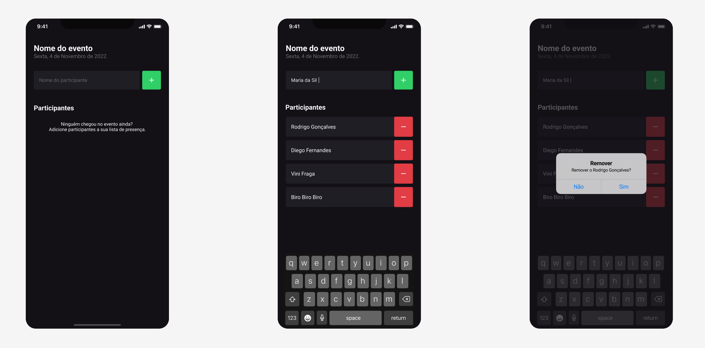

# I'm Here


  
  <br>

> Este é um aplicativo mobile simples usando React Native. faz parte do módulo 01 do programa de aceleração Ignite da [Rocketseat](http://app.ropcketseat.com.br)



## Detalhes do aplicativo

- Trata-se de um aplicativo simples que simula a tela de uma lista de presença para um evento onde podem ser adicionados nome de participantes a medida que o participante chega

## 🚀 TODO de melhorias
- [ ] - Conectar com uma api própria ou um cms
- [ ] - Permitir o usuário criar eventos
- [ ] - Fornecer uma landing page onde o usuário obtenha informações do evento e possa se inscrever
- [ ] - Enviar um email para o usuário com o QRCode do ingresso do evento que ele se increveu
- [ ] - Incluir uma tela gerencial onde o produtor do evento possa ver a quantidade de inscritos
- [ ] - incluir uma tela de Check-in onde seja possivel ler o QR code do convidado e validar a sua presença no evento

## 💻 Como usar o projeto
Para gerar uma cópia do projeto e implementar as suas melhorias, esteja em um computador com Node Js instalado e siga as etapas abaixo:

1  clone o projeto com o comando 
```
git clone https://github.com/oeujack/imhere
``` 
2  Acesse o projeto pelo terminal com o comando 
```
cd imhere
```  
3  Instale as dependências necessárias com o comando
```
npm install
```

4  Rode o projeto com o comando
```
npm run android
``` 
5  Acesse o aplicativo em seu dispositívo físico com o app Expo Go ou pelo Android Studio 

## 🌐 Links úteis
[NodeJS](https://nodejs.org/en/download)  
[Expo](https://expo.dev/)  
[Android Studio](https://developer.android.com/studio/install?hl=pt-br)  
[Figma do projeto](https://www.figma.com/file/AXOlKzH6ZUmKXWqfQXquhe/Chapter-I---Im-Here?type=design&node-id=0%3A1&mode=design&t=2D2quWd8YnSN11KK-1)


## 🧑‍💻 Jackson dos Santos
[](https://www.linkedin.com/in/jackson-dos-santos/)
[](https://github.com/oeujack)
